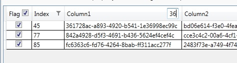

### Filtering

Filtering is enabled by simply adding one attached property to your DataGrid:
```xml
<DataGrid ItemsSource="{Binding Items}" 
          dgx:DataGridFilter.IsAutoFilterEnabled="True"/>
```
You will get a simple but efficient text or boolean filter, depending on the column type:


Every part is easily customizable by providing simple styles or templates:
```xml
<DataGridTextColumn Header="Double/Custom" 
                    Binding="{Binding Probability, Mode=OneWay}" 
                    dgx:DataGridFilterColumn.Template="{StaticResource FilterWithPopup}"/>
```
By overriding the default template you can simply create individual filters:


### Filtering and Sorting a Template Column
Since a Template Column may content everything, we must specify which member will be used to filter and sort content using `SortMemberPath`:

```xml
<DataGridTemplateColumn Header="Template" 
                        SortMemberPath="Column5" 
                        dgx:DataGridFilterColumn.Template="{StaticResource MultipleChoiceFilter}"> 
    <DataGridTemplateColumn.CellTemplate> 
        <DataTemplate DataType="{x:Type basicSample:DataItem}" > 
            <TextBox Text="{Binding Column5}"/> 
        </DataTemplate> 
    </DataGridTemplateColumn.CellTemplate> 
</DataGridTemplateColumn>
```


For further details take a tour through the code of the sample application to see the many possibilities how to use and customize it.
